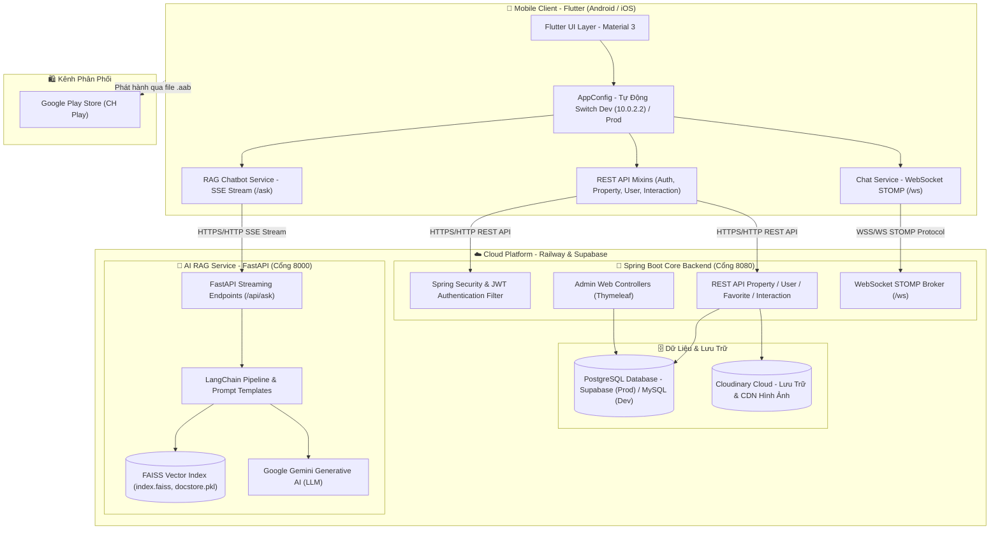

<div align="center">

# 🏡 HỆ THỐNG QUẢN LÝ BẤT ĐỘNG SẢN ĐA NỀN TẢNG TÍCH HỢP TƯ VẤN THÔNG MINH
### Nền Tảng Công Nghệ Bất Động Sản Toàn Diện Tích Hợp Trợ Lý Ảo AI & Chat Thời Gian Thực

[](https://flutter.dev)
[](https://dart.dev)
[](https://spring.io/projects/spring-boot)
[](https://www.oracle.com/java/)
[](https://fastapi.tiangolo.com)
[](https://www.python.org)
[](https://www.langchain.com)
[](https://supabase.com)
[](https://www.mysql.com/)
[](https://railway.app)
[](https://play.google.com)

</div>

---

## 📖 1. Giới Thiệu Dự Án

**Hệ Thống Quản Lý Bất Động Sản Đa Nền Tảng Tích Hợp Tư Vấn Thông Minh** là giải pháp nền tảng công nghệ bất động sản toàn diện (**PropTech Platform**) hiện đại, kết nối trực tiếp giữa người có nhu cầu mua bán/thuê bất động sản và môi giới/chủ sở hữu. Hệ thống được xây dựng trên kiến trúc hướng dịch vụ (**Microservices / Modular Distributed Architecture**) gồm:

1. **Ứng dụng di động đa nền tảng (Flutter)**: Giao diện Material 3 mượt mà, tối ưu hóa trải nghiệm tìm kiếm, quản lý bài đăng và tích hợp trợ lý ảo thông minh.
2. **Hệ thống dịch vụ lõi (Spring Boot Core Backend)**: Quản trị tài khoản, danh mục bất động sản, phân quyền JWT, tương tác dữ liệu và hệ thống tin nhắn **WebSocket STOMP** thời gian thực.
3. **Trung tâm trí tuệ nhân tạo (FastAPI + LangChain + FAISS + Gemini LLM)**: Trợ lý tư vấn bất động sản thông minh theo kỹ thuật **RAG (Retrieval-Augmented Generation)**, streaming câu trả lời theo thời gian thực (Server-Sent Events).
4. **Cơ sở dữ liệu linh hoạt**: Tương thích cả **MySQL** (môi trường Local Dev) và **PostgreSQL Supabase Cloud** (môi trường Live Production).

---

## 🚀 2. Điểm Nhấn Công Nghệ & Trạng Thái Triển Khai

| Thành phần | Công nghệ chính | Trạng thái triển khai | Địa chỉ Live / Kênh phân phối |
| :--- | :--- | :---: | :--- |
| **Mobile App** | Flutter 3.24+, Dart, Material 3, Android App Bundle | ✅ Đã phát hành | Google Play Store (`com.ndnt.realestate`) |
| **Core Backend** | Spring Boot 3.x, Java 21, Spring Security, JWT, JPA, WebSocket STOMP | ✅ Đang chạy 24/7 | `https://realestatemobile-project-production.up.railway.app` |
| **AI RAG Service** | Python 3.10+, FastAPI, LangChain, FAISS Vector DB, Google Gemini LLM | ✅ Đang chạy 24/7 | `https://real-estate-ai-production-e985.up.railway.app` |
| **Cơ sở dữ liệu** | PostgreSQL Cloud (Supabase) / MySQL Local, Cloudinary Image Storage | ✅ Đang chạy 24/7 | Supabase Cloud Database & Cloudinary CDN |

---

## 🏛️ 3. Kiến Trúc Toàn Hệ Thống



---

## ✨ 4. Các Tính Năng Nổi Bật

### 4.1. Ứng Dụng Di Động (Flutter)
- **Tìm kiếm & Bộ lọc BĐS chuyên sâu**: Lọc theo khu vực (Tỉnh/Thành phố, Quận/Huyện, Phường/Xã), khoảng giá, diện tích, phân loại (nhà riêng, căn hộ, biệt thự, đất nền, phòng trọ...).
- **Chi tiết Bất Động Sản sắc nét**: Slider trình diễn hình ảnh chất lượng cao (tích hợp Cloudinary), thông số chi tiết (pháp lý, hướng nhà, số phòng), vị trí và nút liên hệ nhanh người bán.
- **Trợ lý ảo AI tư vấn (AI Floating Chat)**: Cửa sổ chat nổi trực tiếp trên màn hình, hỗ trợ streaming từng chữ phản hồi theo thời gian thực (SSE), giải đáp pháp lý và định giá thị trường.
- **Nhắn tin thời gian thực 1-1 (Live Chat)**: Kết nối trực tiếp giữa khách hàng và người bán bằng giao thức WebSocket STOMP.
- **Xác thực linh hoạt**: Hỗ trợ đăng nhập truyền thống (JWT), đăng nhập nhanh bằng **Google Sign-In** hoặc **Facebook Login**.
- **Đăng tin & Quản lý bài đăng**: Dành cho người bán/môi giới với tính năng upload ảnh từ thư viện/camera, quản lý khách hàng quan tâm (`SellerOverview`, `SellerProperties`, `SellerCustomers`).
- **Lưu tin yêu thích & Lịch sử tương tác**: Quản lý tin BĐS quan tâm, hỗ trợ liên hệ lại bất cứ lúc nào.
- **Chuyển đổi môi trường thông minh (`AppConfig.dart`)**: Tự động nhận biết môi trường máy ảo Android Emulator (`10.0.2.2`) khi Debug hoặc chuyển sang Live Server Railway khi Build Production.

### 4.2. Hệ Thống Dịch Vụ Lõi (Spring Boot)
- **Kiến trúc phân tầng chuẩn mực**: Tách biệt rõ rệt `Controller`, `Service`, `Repository`, `Entity`, `DTO` và `Converter`.
- **Hệ thống bảo mật đa tầng**: Cấu hình Spring Security với cơ chế JWT Stateless Authentication, phân quyền vai trò (Role-Based Access Control).
- **Trang quản trị Admin Web**: Tích hợp sẵn Thymeleaf quản lý người dùng, danh mục, khu vực địa lý và bài đăng trực tiếp trên trình duyệt.
- **Đồng bộ hóa tin nhắn**: Xử lý hàng đợi tin nhắn WebSocket và lưu vết lịch sử tương tác khách hàng.
- **Hỗ trợ đa cơ sở dữ liệu**: Dễ dàng chuyển đổi giữa MySQL (chạy local) và PostgreSQL Supabase (chạy production) chỉ qua profile cấu hình.

### 4.3. Dịch Vụ Trí Tuệ Nhân Tạo (FastAPI & LangChain)
- **Kỹ thuật RAG tiên tiến**: Kết hợp Vector Search (FAISS) với kiến thức pháp lý và dữ liệu BĐS Việt Nam để giảm thiểu tối đa hiện tượng ảo giác (hallucination) của mô hình ngôn ngữ lớn.
- **Phản hồi Streaming cực nhanh**: Giảm thời gian chờ phản hồi đầu tiên (Time-to-First-Token) xuống dưới 1 giây.
- **Cơ sở dữ liệu Vector nhúng sẵn**: Lưu trữ sẵn trong `vector_database/` (bao gồm `index.faiss`, `docstore.pkl`, `index.pkl`), không cần build lại index từ đầu khi clone về.

---

## 📁 5. Cấu Trúc Thư Mục Toàn Vẹn Hệ Thống

Dự án được tổ chức theo mô hình Monorepo chứa trọn vẹn cả 3 tầng ứng dụng:

```text
RealEstateMobile-Project/
│
├── .vscode/                               # Cấu hình phát triển trên Visual Studio Code
│   └── launch.json                        # Cấu hình 1-click debug Flutter (Dev Local vs Prod Railway)
│
├── real-estate-backend/                   # 🍃 DỊCH VỤ LÕI BACKEND (SPRING BOOT 3 / JAVA 21)
│   ├── src/main/java/com/ndnt/
│   │   ├── configs/                       # Cấu hình hệ thống
│   │   │   ├── ApiSecurityConfig.java     # Cấu hình Security cho REST API di động
│   │   │   ├── CloudinaryConfig.java      # Cấu hình tích hợp lưu trữ hình ảnh Cloudinary
│   │   │   ├── DataSourceConfig.java      # Cấu hình nguồn dữ liệu & kết nối DB
│   │   │   ├── JpaAuditingConfig.java     # Tự động ghi nhận thời gian tạo/cập nhật entity
│   │   │   ├── ModelMapperConfig.java     # Cấu hình thư viện map tự động DTO - Entity
│   │   │   ├── SpringSecurityConfig.java  # Cấu hình phân quyền & Security cho web admin
│   │   │   └── WebSocketConfig.java       # Cấu hình STOMP WebSocket Message Broker (/ws)
│   │   ├── controlleradvices/             # Quản lý & bắt lỗi tập trung (Global Exception Handling)
│   │   │   └── exceptions/                # Các ngoại lệ tùy biến (NotFoundException, AuthException...)
│   │   ├── controllers/
│   │   │   ├── admin/                     # Controller phục vụ giao diện quản trị Web (Thymeleaf)
│   │   │   │   ├── HomeController.java    # Trang chủ dashboard admin
│   │   │   │   ├── UserController.java    # Quản lý người dùng, phân quyền
│   │   │   │   ├── PropertyController.java# Kiểm duyệt bài đăng bất động sản
│   │   │   │   └── ...                    # Quản lý quận huyện, phường xã, loại BĐS
│   │   │   └── api/                       # REST API Controllers phục vụ Mobile Client
│   │   │       ├── APILoginController.java        # Đăng ký, đăng nhập JWT, Google/Facebook OAuth
│   │   │       ├── APIPropertyController.java     # Tìm kiếm, phân trang, lọc, đăng tin BĐS
│   │   │       ├── APIUserController.java         # Lấy và cập nhật hồ sơ người dùng
│   │   │       ├── APIInteractionController.java  # Đánh dấu yêu thích, tương tác bài viết
│   │   │       └── APIChatController.java         # Quản lý lịch sử đoạn chat & tin nhắn
│   │   ├── converter/                     # Các class mapper chuyển đổi DTO <-> Entity
│   │   ├── filters/                       # Bộ lọc HTTP Request (JWTAuthenticationFilter)
│   │   ├── model/
│   │   │   ├── dto/                       # Data Transfer Objects
│   │   │   │   ├── request/               # Các DTO nhận payload từ Client
│   │   │   │   └── response/              # Các DTO chuẩn hóa dữ liệu trả về Client
│   │   │   ├── entity/                    # Các thực thể cơ sở dữ liệu JPA (ORM)
│   │   │   │   ├── UserEntity.java        # Bảng người dùng
│   │   │   │   ├── PropertyEntity.java    # Bảng thông tin bất động sản
│   │   │   │   ├── PropertyImageEntity.java # Bảng danh sách ảnh BĐS
│   │   │   │   ├── FavoritePropertyEntity.java # Bảng BĐS yêu thích
│   │   │   │   ├── InteractionEntity.java # Bảng tương tác, bình luận, đánh giá
│   │   │   │   ├── DistrictEntity.java    # Bảng Quận / Huyện
│   │   │   │   ├── WardEntity.java        # Bảng Phường / Xã
│   │   │   │   ├── RoleEntity.java        # Bảng vai trò người dùng
│   │   │   │   └── BaseEntity.java        # Entity nền tảng (id, createdDate, updatedDate)
│   │   │   └── enums/                     # Định nghĩa hằng số Enum (UserRole, PropertyStatus...)
│   │   ├── repositories/                  # Spring Data JPA Repositories
│   │   │   └── custom/impl/               # Truy vấn động tiêu chí BĐS bằng CriteriaBuilder
│   │   ├── services/                      # Interface các tầng nghiệp vụ logic
│   │   │   └── impl/                      # Lớp hiện thực hóa nghiệp vụ (UserServiceImpl, PropertyServiceImpl...)
│   │   └── utils/                         # Tiện ích bổ trợ (JWTProvider, FileUploadUtils...)
│   ├── src/main/resources/
│   │   ├── application.properties         # Cấu hình môi trường Local Dev (MySQL cổng 8080)
│   │   ├── application-prod.properties    # Cấu hình môi trường Production (PostgreSQL Supabase trên Railway)
│   │   ├── application-secret.properties  # Lưu trữ secret keys (JWT, Mail SMTP, OAuth Client ID)
│   │   ├── static/                        # CSS, JS, hình ảnh tĩnh cho giao diện Admin Web
│   │   └── templates/                     # Giao diện HTML Thymeleaf cho Admin Web
│   ├── Dockerfile                         # Thiết lập đóng gói container backend
│   ├── pom.xml                            # Quản lý thư viện Maven (Spring Boot, Cloudinary, MySQL, PostgreSQL...)
│   ├── mvnw & mvnw.cmd                    # Maven Wrapper cho Linux/macOS và Windows
│   └── HELP.md
│
├── real-estate-ai/                        # 🤖 DỊCH VỤ TRÍ TUỆ NHÂN TẠO (FASTAPI / LANGCHAIN / RAG)
│   ├── api/                               # Tầng giao diện API của AI Service
│   │   ├── routes.py                      # Định nghĩa route `/api/ask` (hỗ trợ SSE stream & JSON response)
│   │   └── schemas.py                     # Định nghĩa Pydantic schema (QueryRequest, QueryResponse)
│   ├── rag/                               # Lõi xử lý RAG (Retrieval-Augmented Generation)
│   │   └── pipeline.py                    # Nạp VectorStore, thiết lập Prompt Template BĐS, nối chuỗi LLM
│   ├── vector_database/                   # Cơ sở dữ liệu Vector FAISS đã được build sẵn
│   │   ├── index.faiss                    # Vector Index nhị phân cho tìm kiếm tương đồng ngữ nghĩa
│   │   ├── index.pkl                      # Metadata ánh xạ của FAISS
│   │   └── docstore.pkl                   # Kho tài liệu gốc tương ứng với các vector
│   ├── papers/                            # Tài liệu văn bản tham khảo & dữ liệu huấn luyện BĐS
│   ├── main.py                            # Điểm khởi chạy FastAPI, cấu hình CORS, Lifespan nạp AI Model
│   ├── requirements.txt                   # Danh sách thư viện Python (FastAPI, Uvicorn, LangChain, FAISS...)
│   ├── Dockerfile                         # Thiết lập đóng gói container AI Service
│   └── .env                               # Biến môi trường cục bộ (chứa GOOGLE_API_KEY)
│
├── real_estate_frontend/                  # 📱 ỨNG DỤNG DI ĐỘNG FLUTTER (MATERIAL 3)
│   ├── android/                           # Mã nguồn và cấu hình native Android
│   │   ├── app/
│   │   │   ├── build.gradle.kts           # Cấu hình App ID, SDK version, Signing Config
│   │   │   └── src/main/AndroidManifest.xml # Khai báo quyền (Internet, Camera, Storage, Facebook SDK)
│   │   ├── build.gradle.kts               # Cấu hình Gradle toàn cục của Android
│   │   └── key.properties (tùy chọn)      # Cấu hình ký số khi release app lên Google Play
│   ├── lib/                               # Mã nguồn chính của ứng dụng Flutter
│   │   ├── config/
│   │   │   └── AppConfig.dart             # Quản lý tập trung URL API, tự động switch Local (10.0.2.2) vs Prod
│   │   ├── dto/                           # Data Transfer Objects tầng di động
│   │   │   ├── ChatMessageDTO.dart        # Dữ liệu gói tin nhắn chat
│   │   │   ├── PropertyDTO.dart           # Dữ liệu bất động sản
│   │   │   ├── PropertyPageResponseDTO.dart # Dữ liệu phân trang BĐS
│   │   │   ├── PropertyRequestDTO.dart    # Dữ liệu đăng bài viết BĐS mới
│   │   │   └── UserDTO.dart               # Dữ liệu thông tin tài khoản người dùng
│   │   ├── layout/                        # Các thành phần giao diện mẫu dùng chung
│   │   │   └── Footer.dart
│   │   ├── mixin/
│   │   │   ├── api/                       # Các Mixin đóng gói hàm gọi API HTTP
│   │   │   │   ├── ApiLoginMixin.dart     # API Đăng nhập, Đăng ký, Quên mật khẩu
│   │   │   │   ├── APIPropertyMixin.dart  # API Lấy danh sách, Lọc, Chi tiết, Đăng tin BĐS
│   │   │   │   ├── ApiUserMixin.dart      # API Cập nhật thông tin tài khoản
│   │   │   │   └── APIInteractionMixin.dart # API Yêu thích, Bình luận
│   │   │   └── validation/
│   │   │       └── ValidationMixin.dart   # Kiểm tra tính hợp lệ dữ liệu nhập (email, phone...)
│   │   ├── screens/                       # Các màn hình giao diện chính của ứng dụng
│   │   │   ├── Account.dart               # Màn hình quản lý tài khoản & trung tâm cài đặt
│   │   │   ├── Auth.dart                  # Màn hình đăng nhập / đăng ký / OAuth (Google, Facebook)
│   │   │   ├── ChangePassword.dart        # Màn hình đổi mật khẩu
│   │   │   ├── ChatScreen.dart            # Màn hình chat trực tiếp 1-1 với người bán qua WebSocket
│   │   │   ├── FAQ.dart                   # Màn hình câu hỏi thường gặp
│   │   │   ├── ForgotPassword.dart        # Màn hình khôi phục mật khẩu qua Email OTP
│   │   │   ├── Home.dart                  # Màn hình trang chủ (Banner, BĐS nổi bật, danh mục)
│   │   │   ├── MainScreen.dart            # Thanh Bottom Navigation Bar chuyển đổi tab nhanh
│   │   │   ├── PostProperty.dart          # Màn hình đăng tin bán / cho thuê BĐS
│   │   │   ├── PrivacyPolicy.dart         # Màn hình chính sách bảo mật
│   │   │   ├── PropertyDetail.dart        # Màn hình chi tiết BĐS (Gallery, tiện ích, người bán)
│   │   │   ├── PropertyList.dart          # Màn hình tìm kiếm & lọc BĐS nâng cao
│   │   │   ├── SaveNews.dart              # Màn hình danh sách tin đăng BĐS đã lưu
│   │   │   ├── Terms.dart                 # Màn hình điều khoản sử dụng
│   │   │   ├── UserProfile.dart           # Màn hình xem và chỉnh sửa thông tin cá nhân
│   │   │   └── seller/                    # Phân hệ dành cho người bán / chuyên viên môi giới
│   │   │       ├── SellerOverview.dart    # Bảng tổng quan thống kê bài đăng của người bán
│   │   │       ├── SellerProperties.dart  # Danh sách bài đăng của tôi (Sửa, Xóa, Ẩn)
│   │   │       ├── SellerCustomers.dart   # Quản lý khách hàng đang quan tâm
│   │   │       └── SellerChatCustomersScreen.dart # Hộp thư danh sách khách hàng đang chat
│   │   ├── services/                      # Các dịch vụ kết nối mạng nâng cao
│   │   │   ├── ChatService.dart           # Dịch vụ WebSocket STOMP (kết nối, subscribe, gửi tin)
│   │   │   └── RagChatService.dart        # Dịch vụ giao tiếp AI RAG qua Server-Sent Events (SSE)
│   │   ├── utils/                         # Hàm hỗ trợ tiện ích (Currency format, Date format...)
│   │   ├── widgets/                       # Các widget UI tùy chỉnh dùng lại
│   │   │   └── RagChatModal.dart          # Widget Trợ lý ảo AI nổi (Floating Chatbox)
│   │   └── main.dart                      # Điểm khởi chạy Flutter App, cấu hình Theme & Route
│   ├── pubspec.yaml                       # Quản lý dependencies thư viện Flutter
│   └── analysis_options.yaml              # Quy chuẩn phân tích mã nguồn Dart
│
└── README.md                              # Tài liệu hướng dẫn toàn diện dự án
```

---

## 🛠️ 6. Hướng Dẫn Cài Đặt & Chạy Cục Bộ (Local Testing Guide)

Khi một thành viên mới clone repository này về máy tính cá nhân để phát triển hoặc kiểm thử (test), bạn có thể lựa chọn **1 trong 2 kịch bản**:

- **Kịch bản 1 (Khuyên dùng nếu chỉ muốn test nhanh giao diện Mobile App)**: Kết nối trực tiếp vào Backend & AI đã được tác giả triển khai sẵn trên Cloud Railway (chỉ mất 2 phút cài Flutter).
- **Kịch bản 2 (Chạy Full-Stack Cục Bộ từ A đến Z)**: Khởi chạy toàn bộ Database, Spring Boot, Python FastAPI và Flutter trên chính máy tính của bạn.

---

### 🌟 KỊCH BẢN 1: Quick Start - Test Nhanh Mobile App (Không Cần Cài Backend & DB)

Backend và AI Service của dự án đã được deploy sẵn trên hạ tầng Railway và hoạt động ổn định 24/7. Bạn có thể kiểm thử ngay ứng dụng di động:

```bash
# 1. Clone repository về máy
git clone https://github.com/NhatTruong1905/RealEstateMobile-Project.git
cd RealEstateMobile-Project/real_estate_frontend

# 2. Cài đặt thư viện Flutter
flutter pub get

# 3. Khởi chạy ứng dụng và trỏ vào Server Production Cloud
flutter run --dart-define=ENV=prod
```

> [!TIP]
> Nếu bạn sử dụng **Visual Studio Code**, chỉ cần mở thư mục dự án, nhấn phím **F5**, sau đó chọn cấu hình:
> **`Flutter: Chạy Deploy (Prod - Railway)`** từ menu danh sách. Ứng dụng sẽ tự khởi chạy trên máy ảo hoặc thiết bị kết nối.

---

### 💻 KỊCH BẢN 2: Khởi Chạy Toàn Bộ Hệ Thống Cục Bộ (Full-Stack Local)

#### 📋 Yêu Cầu Môi Trường Tiên Quyết
Đảm bảo máy tính của bạn đã cài đặt các công cụ sau:
- **Git** (để clone mã nguồn).
- **Java Development Kit (JDK)**: Phiên bản **Java 21** (khuyên dùng) hoặc tối thiểu **Java 17**.
- **Python**: Phiên bản **3.10** đến **3.12** kèm `pip`.
- **Cơ sở dữ liệu**: Cài đặt **MySQL 8.0+** (hoặc chuẩn bị tài khoản PostgreSQL miễn phí tại [Supabase](https://supabase.com)).
- **Flutter SDK**: Phiên bản **3.24+** (đã thiết lập môi trường Android Studio, Android SDK và Android Emulator).

---

#### 🔹 BƯỚC 1: Cấu Hình Cơ Sở Dữ Liệu (Database Setup)

##### Lựa chọn 1: Dùng MySQL Cục Bộ (Mặc định cho Dev)
1. Khởi động MySQL Server của bạn (cổng mặc định `3306`).
2. Mở công cụ quản lý cơ sở dữ liệu (như MySQL Workbench, DBeaver hoặc Terminal) và tạo database mới:
   ```sql
   CREATE DATABASE realestate_db CHARACTER SET utf8mb4 COLLATE utf8mb4_unicode_ci;
   ```
3. Mở file [application.properties](file:///d:/RealEstateMobile-Project/real-estate-backend/src/main/resources/application.properties) trong `real-estate-backend/src/main/resources/` và điều chỉnh thông số cho khớp với tài khoản MySQL của bạn:
   ```properties
   spring.datasource.driver-class-name=com.mysql.cj.jdbc.Driver
   spring.datasource.url=jdbc:mysql://localhost:3306/realestate_db
   spring.datasource.username=root
   spring.datasource.password=root@123
   ```
   *(Mẹo: Nếu muốn Hibernate tự động sinh toàn bộ bảng trong lần khởi chạy đầu tiên, bạn có thể tạm thời đổi dòng `spring.jpa.hibernate.ddl-auto=none` thành `spring.jpa.hibernate.ddl-auto=update`).*

##### Lựa chọn 2: Dùng PostgreSQL Supabase Cloud
Nếu bạn muốn dùng cơ sở dữ liệu trên đám mây của Supabase, bạn chỉ cần cấu hình chuỗi kết nối trong `application.properties`:
```properties
spring.datasource.url=jdbc:postgresql://<supabase-host>:5432/<dbname>
spring.datasource.username=postgres
spring.datasource.password=<supabase-db-password>
spring.datasource.driver-class-name=org.postgresql.Driver
```

---

#### 🔹 BƯỚC 2: Khởi Chạy Core Backend (Spring Boot)

1. Mở cửa sổ dòng lệnh tại thư mục backend:
   ```bash
   cd RealEstateMobile-Project/real-estate-backend
   ```
2. Kiểm tra file `src/main/resources/application-secret.properties`. File này đã được thiết lập sẵn các khóa bí mật mặc định phục vụ chạy thử:
   - Khóa ký JWT: `JWT_SECRET`
   - Gemini API Key: `spring.ai.openai.api-key`
   - Google / Facebook OAuth credentials.
3. Khởi chạy server bằng **Maven Wrapper** đi kèm sẵn trong dự án:
   - **Trên Windows (PowerShell / Command Prompt)**:
     ```powershell
     .\mvnw.cmd spring-boot:run
     ```
   - **Trên Linux / macOS**:
     ```bash
     chmod +x mvnw
     ./mvnw spring-boot:run
     ```
4. **Kiểm tra trạng thái Backend**:
   - Mở trình duyệt truy cập: `http://localhost:8080/api/properties`
   - Nếu nhận về kết quả JSON trạng thái `200 OK` (hoặc mảng bài đăng rỗng `[]`), backend đã khởi động thành công!
   - Bạn cũng có thể truy cập trang quản trị web admin tại: `http://localhost:8080/`

---

#### 🔹 BƯỚC 3: Khởi Chạy Trí Tuệ Nhân Tạo AI Service (FastAPI)

1. Mở cửa sổ dòng lệnh mới tại thư mục AI:
   ```bash
   cd RealEstateMobile-Project/real-estate-ai
   ```
2. Tạo và kích hoạt môi trường ảo Python (**Virtual Environment**):
   - **Trên Windows**:
     ```powershell
     python -m venv .venv
     .\.venv\Scripts\activate
     ```
   - **Trên Linux / macOS**:
     ```bash
     python3 -m venv .venv
     source .venv/bin/activate
     ```
3. Cài đặt toàn bộ các thư viện cần thiết:
   ```bash
   pip install -r requirements.txt
   ```
4. Thiết lập file biến môi trường `.env`:
   Tạo file mang tên `.env` trong thư mục `real-estate-ai/` và điền Google Gemini API Key của bạn:
   ```env
   GOOGLE_API_KEY=your_gemini_api_key_here
   ```
   > [!NOTE]
   > Bạn có thể tạo **Google Gemini API Key hoàn toàn miễn phí** chỉ với tài khoản Google tại: [Google AI Studio](https://aistudio.google.com/).
5. Khởi chạy máy chủ FastAPI bằng Uvicorn:
   ```bash
   uvicorn main:app --host 0.0.0.0 --port 8000 --reload
   ```
6. **Kiểm tra trạng thái AI Service**:
   - Mở trình duyệt truy cập: `http://localhost:8000/docs`
   - Bạn sẽ thấy giao diện Swagger UI tương tác với endpoint `/api/ask`. Vì Vector Database (`vector_database/`) đã được đính kèm sẵn trong repo, dịch vụ AI có thể trả lời các câu hỏi về bất động sản ngay tức khắc!

---

#### 🔹 BƯỚC 4: Khởi Chạy Ứng Dụng Di Động (Flutter Frontend)

##### 1. Hiểu Về Cơ Chế Mạng Khi Chạy Local (`AppConfig.dart`)
Tệp [AppConfig.dart](file:///d:/RealEstateMobile-Project/real_estate_frontend/lib/config/AppConfig.dart) được thiết lập tự động:
- **Khi chạy trên Android Emulator (Máy ảo Android Studio)**: Máy ảo sử dụng địa chỉ đặc biệt `10.0.2.2` để truy cập vào cổng `localhost` của máy tính. Vì vậy, mặc định `AppConfig.dart` trỏ sẵn đến `http://10.0.2.2:8080` (Spring Boot) và `http://10.0.2.2:8000` (FastAPI AI). **Bạn không cần chỉnh sửa bất kỳ dòng code nào khi chạy với Android Emulator!**
- **Khi chạy trên Điện Thoại Thật (Cắm cáp USB hoặc Wi-Fi Debugging)**: Điện thoại thật không thể hiểu địa chỉ `10.0.2.2`. Bạn hãy mở [AppConfig.dart](file:///d:/RealEstateMobile-Project/real_estate_frontend/lib/config/AppConfig.dart) và sửa biến:
  ```dart
  // Thay 192.168.x.x bằng IP LAN của máy tính bạn (xem bằng lệnh ipconfig hoặc ifconfig)
  static const String _springBootLocalHost = '192.168.1.15:8080';
  static const String _aiLocalHost = '192.168.1.15:8000';
  ```
  *(Đảm bảo điện thoại và máy tính cùng kết nối chung một mạng Wi-Fi).*

##### 2. Lệnh Khởi Chạy Ứng Dụng
1. Mở cửa sổ dòng lệnh tại thư mục frontend:
   ```bash
   cd RealEstateMobile-Project/real_estate_frontend
   ```
2. Kiểm tra danh sách thiết bị/máy ảo đang kết nối:
   ```bash
   flutter devices
   ```
3. Lấy dependencies:
   ```bash
   flutter pub get
   ```
4. Khởi chạy ứng dụng (mặc định môi trường Dev Local):
   ```bash
   flutter run
   ```
5. *(Tùy chọn)* Nếu sử dụng **VS Code**, bạn chỉ việc nhấn **F5** và chọn:
   **`Flutter: Chạy Local (Dev - 10.0.2.2)`**.

---

## ⚙️ 7. Bảng Tổng Hợp Tham Số Cấu Hình Hệ Thống

### Backend Configuration (`real-estate-backend/src/main/resources/`)
| Tên File | Tham Số Chính | Chức năng |
| :--- | :--- | :--- |
| `application.properties` | `server.port=8080`<br>`spring.datasource.url`<br>`spring.jpa.hibernate.ddl-auto` | Cổng dịch vụ backend, thông tin kết nối MySQL/PostgreSQL và chế độ tự sinh schema JPA. |
| `application-secret.properties` | `JWT_SECRET`<br>`spring.ai.openai.api-key`<br>`GOOGLE_CLIENT_ID`<br>`FACEBOOK_APP_ID`<br>`spring.mail.*` | Chìa khóa mã hóa JWT, API key Gemini (qua OpenAI format), OAuth Client IDs và tài khoản gửi mail OTP. |
| `application-prod.properties` | `spring.datasource.url=${DATABASE_URL}` | Cấu hình nhận biến môi trường khi deploy lên Railway Production. |

### AI Service Configuration (`real-estate-ai/`)
| Tên File | Tham Số Chính | Chức năng |
| :--- | :--- | :--- |
| `.env` | `GOOGLE_API_KEY` | API Key của Google Gemini dùng để thực hiện suy luận RAG và sinh văn bản trả lời. |
| `vector_database/` | `index.faiss`, `docstore.pkl` | Kho tri thức bất động sản đã được nhúng vector, nạp tự động khi ứng dụng khởi chạy. |

### Frontend Configuration (`real_estate_frontend/lib/config/AppConfig.dart`)
| Chế độ | Biến cấu hình | Giá trị mặc định |
| :--- | :--- | :--- |
| **Dev Mode** (Local) | `springBootBaseUrl`<br>`springBootWsUrl`<br>`aiBaseUrl` | `http://10.0.2.2:8080/api`<br>`ws://10.0.2.2:8080/ws`<br>`http://10.0.2.2:8000/api` |
| **Prod Mode** (Railway) | `--dart-define=ENV=prod`<br>hoặc Release Mode | `https://realestatemobile-project-production.up.railway.app/api`<br>`wss://realestatemobile-project-production.up.railway.app/ws`<br>`https://real-estate-ai-production-e985.up.railway.app/api` |

---

## 📦 8. Hướng Dẫn Đóng Gói & Phát Hành CH Play

### 1. Chuẩn Bị Keystore & File Cấu Hình Ký Số
Tạo file `key.properties` tại đường dẫn `real_estate_frontend/android/key.properties` (file này đã được bảo vệ trong `.gitignore`):
```properties
storePassword=your_keystore_password
keyPassword=your_keystore_password
keyAlias=upload
storeFile=app/upload-keystore.jks
```

### 2. Lệnh Build Android App Bundle (.aab)
```bash
cd real_estate_frontend
flutter clean
flutter pub get
flutter build appbundle --release
```
*Gói bundle sau khi hoàn tất nằm tại:*
`real_estate_frontend/build/app/outputs/bundle/release/app-release.aab`

Tải tệp `.aab` này lên Google Play Console để phát hành cho người dùng.

---

## ❓ 9. Xử Lý Sự Cố Thường Gặp (Troubleshooting FAQ)

<details>
<summary><b>1. Flutter gặp lỗi không kết nối được Backend khi chạy trên máy ảo Android (Connection Refused)?</b></summary>
<br>

- Đảm bảo Backend Spring Boot đã được khởi chạy thành công tại cổng `8080`.
- Trên máy ảo Android Emulator, địa chỉ `localhost` của máy host luôn là **`10.0.2.2`**, không dùng `localhost` hay `127.0.0.1`.
- Kiểm tra [AndroidManifest.xml](file:///d:/RealEstateMobile-Project/real_estate_frontend/android/app/src/main/AndroidManifest.xml) đã có thuộc tính `android:usesCleartextTraffic="true"` (mặc định dự án đã cấu hình sẵn).
</details>

<details>
<summary><b>2. Lỗi khi chạy lệnh Maven Wrapper trên Linux/macOS: Permission Denied?</b></summary>
<br>

Chạy lệnh cấp quyền thực thi cho file script:
```bash
chmod +x ./mvnw
```
</details>

<details>
<summary><b>3. AI Service báo lỗi thiếu GOOGLE_API_KEY hoặc lỗi quota?</b></summary>
<br>

- Kiểm tra file `real-estate-ai/.env` đã có dòng `GOOGLE_API_KEY=...` chưa.
- Lấy API Key miễn phí tại [Google AI Studio](https://aistudio.google.com/).
- Khởi động lại Uvicorn sau khi chỉnh sửa file `.env`.
</details>

<details>
<summary><b>4. Chạy thiết bị thật qua USB không gọi được API Local?</b></summary>
<br>

- Máy tính và điện thoại cần kết nối chung một mạng Wi-Fi.
- Mở Terminal trên máy tính, gõ `ipconfig` (Windows) hoặc `ifconfig` (Mac/Linux) để tìm địa chỉ IPv4 LAN (ví dụ `192.168.1.15`).
- Mở `real_estate_frontend/lib/config/AppConfig.dart`, thay thế giá trị `10.0.2.2` bằng IP LAN đó.
</details>

---

## 🔒 10. Bảo Mật & Toàn Vẹn Dữ Liệu
- Toàn bộ giao tiếp mạng trên môi trường Production đều bắt buộc sử dụng giao thức bảo mật cao cấp: **HTTPS (TLS/SSL)** cho REST API và **WSS (WebSocket Secure)** cho tin nhắn thời gian thực.
- Mã nguồn không chứa secret keys của người dùng thật (được phân tách nghiêm ngặt bằng `.env`, `key.properties` và `.gitignore`).
- Tích hợp **Google Play App Signing** để bảo vệ tính toàn vẹn gói cài đặt và xác thực chữ ký SHA-1 cho Google OAuth.

---

## 👨‍💻 11. Tác Giả & Liên Hệ
- **Tác giả**: [NhatTruong1905](https://github.com/NhatTruong1905)
- **Đề tài**: Hệ Thống Quản Lý Bất Động Sản Đa Nền Tảng Tích Hợp Tư Vấn Thông Minh (Multi-Platform Real Estate Management System with Intelligent Assistant)
- **Email**: [tn696199@gmail.com](mailto:tn696199@gmail.com)
- **Repository**: [https://github.com/NhatTruong1905/RealEstateMobile-Project](https://github.com/NhatTruong1905/RealEstateMobile-Project)

---

<div align="center">
⭐ Nếu bạn thấy dự án hữu ích, hãy để lại một Star ủng hộ repository nhé! ⭐
</div>