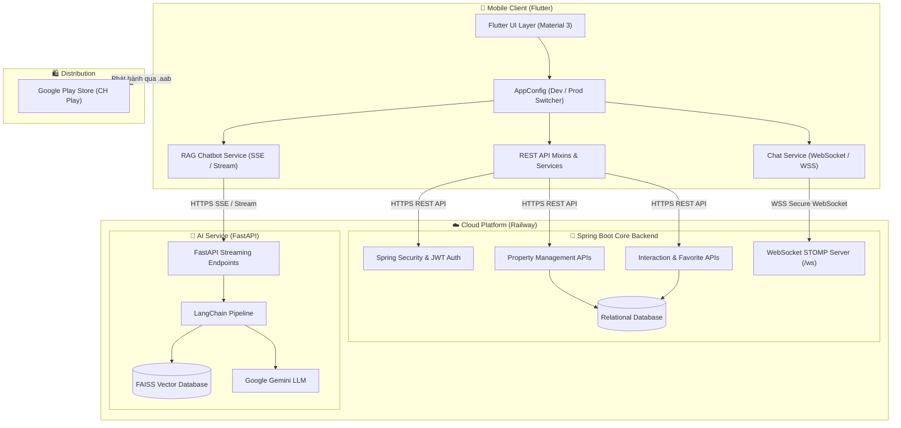

<div align="center">

# 🏡 BẤT ĐỘNG SẢN NDNT (REAL ESTATE MOBILE PLATFORM)
### Hệ Thống Ứng Dụng Di Động Bất Động Sản Tích Hợp Trợ Lý Ảo AI (RAG) & Chat Thời Gian Thực

[](https://flutter.dev)
[](https://dart.dev)
[](https://spring.io/projects/spring-boot)
[](https://www.oracle.com/java/)
[](https://fastapi.tiangolo.com)
[](https://www.python.org)
[](https://www.langchain.com)
[](https://railway.app)
[](https://play.google.com)

</div>

---

## 📖 1. Giới Thiệu Dự Án (Project Overview)

**Bất Động Sản NDNT** là giải pháp nền tảng công nghệ bất động sản toàn diện (PropTech Platform) kết hợp giữa ứng dụng di động đa nền tảng (**Flutter**), hệ thống quản lý dịch vụ lõi phân tán (**Spring Boot**) và trung tâm xử lý trí tuệ nhân tạo thông minh (**FastAPI + LangChain + RAG**).

Dự án cung cấp cho người dùng trải nghiệm tìm kiếm, đăng tin mua bán, cho thuê nhà đất, tương tác thương lượng trực tiếp qua **WebSocket Chat thời gian thực**, cùng với **Trợ lý ảo AI RAG** có khả năng trả lời thông minh dựa trên dữ liệu bất động sản chuyên sâu 24/7.

---

## 🚀 2. Điểm Nhấn Công Nghệ & Triển Khai (Live Deployments)

| Thành phần | Công nghệ chính | Trạng thái triển khai | Địa chỉ Live / Kênh phân phối |
| :--- | :--- | :---: | :--- |
| **Mobile App (Frontend)** | Flutter, Kotlin, Android App Bundle | ✅ Đã phát hành | Google Play Store (`com.ndnt.realestate`) |
| **Core Backend (REST & WS)** | Spring Boot 3, Spring Security, JWT, JPA, WebSocket | ✅ Đang chạy | `https://realestatemobile-project-production.up.railway.app` |
| **AI RAG Service** | Python, FastAPI, LangChain, FAISS Vector DB, Gemini | ✅ Đang chạy | `https://real-estate-ai-production-e985.up.railway.app` |
| **Cơ sở dữ liệu** | MySQL / PostgreSQL, FAISS Vector Store | ✅ Đang chạy | Railway Database Cloud |

---

## 🏛️ 3. Kiến Trúc Hệ Thống (System Architecture)



---

## ✨ 4. Các Tính Năng Nổi Bật (Key Features)

### 4.1. Mobile Application (Flutter)
- **Tìm kiếm & Lọc Bất Động Sản**: Lọc theo khu vực, mức giá, diện tích, loại bất động sản (nhà phố, căn hộ, biệt thự, đất nền...).
- **Chi tiết Bất Động Sản**: Hiển thị bộ sưu tập hình ảnh, thông số kỹ thuật, tiện ích xung quanh, vị trí bản đồ và thông tin người bán.
- **Trợ lý ảo AI tư vấn (RAG Chatbot)**: Giao diện chat thời gian thực hỗ trợ Server-Sent Events (SSE Streaming), phản hồi mượt mà từng từ kèm khả năng truy vấn ngữ nghĩa từ cơ sở dữ liệu tri thức.
- **Chat trực tiếp thời gian thực**: Trò chuyện tức thì giữa người mua và người bán thông qua giao thức WebSocket bảo mật (`wss://`).
- **Xác thực đa kênh (Authentication)**: Đăng nhập bằng tài khoản nội bộ (JWT), tài khoản Google (Google Sign-In) hoặc Facebook (Facebook Auth).
- **Yêu thích & Đăng tin**: Lưu trữ danh sách bất động sản yêu thích, hỗ trợ người dùng đăng tin bán/cho thuê với tính năng tải ảnh từ thư viện hoặc camera.
- **Hỗ trợ Đa môi trường (Environment Profiles)**: Tự động chuyển đổi thông minh giữa Local Dev (`10.0.2.2`) và Production Deploy (Railway HTTPS/WSS) dựa vào cờ compile hoặc chế độ build.

### 4.2. Core Backend (Spring Boot)
- **Kiến trúc phân tầng chuẩn**: Controller, Service, Repository, DTO, Entity và Mapper.
- **Bảo mật Spring Security & JWT**: Quản lý phiên làm việc không trạng thái (Stateless), phân quyền Role-based Access Control (RBAC).
- **WebSocket STOMP & Messaging**: Hỗ trợ nhắn tin riêng tư 1-1, đồng bộ trạng thái tin nhắn và thông báo tương tác.
- **Quản lý dữ liệu quan hệ**: Tối ưu truy vấn dữ liệu bất động sản, quan hệ người dùng, lượt tương tác và danh sách bất động sản yêu thích.

### 4.3. AI RAG Service (FastAPI & LangChain)
- **Kỹ thuật RAG (Retrieval-Augmented Generation)**: Kết hợp LLM với kho dữ liệu văn bản pháp lý và thị trường bất động sản để cung cấp câu trả lời chính xác, tránh hiện tượng ảo giác (hallucination).
- **Vector Database (FAISS)**: Tìm kiếm độ tương đồng vector (Similarity Search) siêu tốc.
- **Streaming Response**: Trả về dữ liệu dạng luồng (Chunk stream) giúp người dùng không phải chờ đợi lâu khi AI phân tích câu hỏi.

---

## 📁 5. Cấu Trúc Thư Mục Toàn Dự Án (Repository Structure)

```text
RealEstateMobile-Project/
├── real_estate_frontend/         # Ứng dụng di động Flutter
│   ├── android/                  # Cấu hình native Android (build.gradle.kts, keystore, manifest)
│   ├── lib/
│   │   ├── config/
│   │   │   └── AppConfig.dart    # Cấu hình môi trường tập trung (Local vs Railway)
│   │   ├── dto/                  # Data Transfer Objects
│   │   ├── layout/               # Layout dùng chung (Header, Footer, Navbar)
│   │   ├── mixin/api/            # Các mixin giao tiếp REST API (User, Property, Login, Interaction)
│   │   ├── screens/              # Màn hình giao diện ứng dụng (Home, Detail, Chat, Auth...)
│   │   ├── services/             # Dịch vụ logic (ChatService - WebSocket, RagChatService - AI)
│   │   └── widgets/              # Các UI Component tái sử dụng
│   ├── pubspec.yaml              # Quản lý dependencies & metadata của Flutter
│   └── README.md
│
├── real-estate-backend/          # Backend chính viết bằng Spring Boot
│   ├── src/main/java/com/ndnt/
│   │   ├── config/               # Cấu hình Security, WebSocket, CORS...
│   │   ├── controller/           # REST Controllers
│   │   ├── model/entity/         # JPA Entities (User, Property, Interaction...)
│   │   ├── repository/           # Spring Data JPA Repositories
│   │   └── service/              # Nghiệp vụ kinh doanh (Business Logic)
│   ├── Dockerfile                # Docker container hóa Spring Boot
│   └── pom.xml                   # Maven dependencies
│
├── real-estate-ai/               # Backend Trí tuệ nhân tạo (RAG Chatbot)
│   ├── api/                      # Routing API FastAPI
│   ├── rag/                      # Pipeline LangChain, RAG chain & Prompt templates
│   ├── vector_database/          # Dữ liệu vector nhúng (FAISS Index)
│   ├── main.py                   # Điểm khởi chạy ứng dụng FastAPI & CORS
│   ├── requirements.txt          # Thư viện Python (FastAPI, LangChain, FAISS...)
│   └── Dockerfile                # Docker container hóa AI Service
│
└── README.md                     # Tài liệu tổng quan dự án
```

---

## 🛠️ 6. Hướng Dẫn Cài Đặt & Chạy Môi Trường Cục Bộ (Local Setup)

### Yêu Cầu Tiên Quyết (Prerequisites)
- **Java**: JDK 17+
- **Python**: 3.10+
- **Flutter**: SDK 3.24+ (kèm Android SDK & cmdline-tools)
- **Database**: MySQL 8.0+ hoặc PostgreSQL

---

### Bước 1: Chạy Spring Boot Backend
```bash
cd real-estate-backend

# Cấu hình thông tin cơ sở dữ liệu trong src/main/resources/application.properties
# Sau đó chạy bằng Maven:
./mvnw clean spring-boot:run
```
*Backend mặc định khởi chạy tại: `http://localhost:8080` (hoặc `http://10.0.2.2:8080` trên Android Emulator).*

---

### Bước 2: Chạy AI RAG Backend
```bash
cd real-estate-ai

# Tạo và kích hoạt môi trường ảo
python -m venv .venv
# Windows:
.venv\Scripts\activate
# Linux/Mac:
source .venv/bin/activate

# Cài đặt thư viện
pip install -r requirements.txt

# Tạo file .env và điền GOOGLE_API_KEY
echo GOOGLE_API_KEY=your_gemini_api_key_here > .env

# Chạy ứng dụng FastAPI
uvicorn main:app --host 0.0.0.0 --port 8000 --reload
```
*AI Service mặc định khởi chạy tại: `http://localhost:8000` (hoặc `http://10.0.2.2:8000` trên Android Emulator).*

---

### Bước 3: Chạy Flutter Frontend

Dự án đã tích hợp sẵn cơ chế nhận biết môi trường tự động trong `AppConfig.dart`:

1. **Chạy kết nối server Local (máy ảo Android):**
   ```bash
   cd real_estate_frontend
   flutter pub get
   flutter run
   ```
2. **Chạy kết nối trực tiếp Backend Railway đã Deploy:**
   ```bash
   cd real_estate_frontend
   flutter run --dart-define=ENV=prod
   ```
3. **Chạy bằng VS Code:** Bấm `F5` và chọn cấu hình mong muốn trong menu `Run & Debug`:
   - `Flutter: Chạy Local (Dev - 10.0.2.2)`
   - `Flutter: Chạy Deploy (Prod - Railway)`

---

## 📦 7. Hướng Dẫn Đóng Gói & Phát Hành CH Play (Google Play Build)

### 1. Chuẩn bị Keystore & File Cấu Hình Ký Số
File `key.properties` được đặt tại `real_estate_frontend/android/key.properties` (được bảo vệ tự động bằng `.gitignore`):
```properties
storePassword=your_keystore_password
keyPassword=your_keystore_password
keyAlias=upload
storeFile=app/upload-keystore.jks
```

### 2. Lệnh Build Android App Bundle (.aab)
```bash
cd real_estate_frontend
flutter clean
flutter pub get
flutter build appbundle --release
```
*Gói bundle thành phẩm sẽ nằm tại:*
`real_estate_frontend/build/app/outputs/bundle/release/app-release.aab`

---

## 🔒 8. Bảo Mật & Toàn Vẹn Dữ Liệu
- Toàn bộ giao tiếp mạng trên môi trường Production đều sử dụng giao thức bảo mật cao cấp: **HTTPS (TLS/SSL)** cho REST API và **WSS (WebSocket Secure)** cho tin nhắn thời gian thực.
- Mã nguồn không chứa bất kỳ secret keys hay thông tin chứng chỉ chữ ký số cá nhân (được phân tách nghiêm ngặt bằng `.env`, `key.properties` và `.gitignore`).
- Tích hợp **Google Play App Signing** để đảm bảo tính toàn vẹn và xác thực chữ ký SHA-1 cho Google OAuth.

---

## 👨‍💻 9. Tác Giả & Đóng Góp (Author)
- **Tác giả**: [NhatTruong1905](https://github.com/NhatTruong1905)
- **Dự án**: Real Estate Mobile Platform with AI & Spring Boot
- **Liên hệ**: nguyennhattruong1905@gmail.com

---

<div align="center">
⭐ Nếu bạn thấy dự án hữu ích, hãy để lại một Star ủng hộ repository nhé! ⭐
</div>